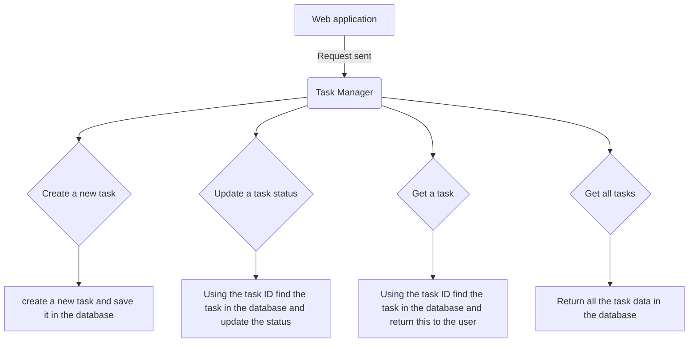

# Task Manager Application V1 

## Description:
A new task manager application is required to assist case workers in managing and tracking their tasks. 
The service creates a database in which to save required data, allowing case workers to retrieve and update task data. 

## Flowchart 

## Project structure: 

## Task Manager Application 
This starts the application and creates the required task manager database.

## Create Task Controller
This class handles the call for a new task to be created, returning a success message with the assigned ID for that task.

## Retrieve Task Controller
This class handles the call to retrieve the details of a particular task, using the ID of the task to search the database and return and data
found. 

## Update status controller
This class handles the call to update the status of a particular task using the ID to search the database and updating the task data.

## Status Validation 
Class to validate the user input status of a task. 

## Task Validation
Class to validate the user input data for the task, class utlises status validation class to validate status. 

## Update Status Validation
Class to validate the user input Id and status of a task, class utilises status validation class to validate status. 

## Empty Task Exception 
Custom exception for when a task details are empty. 

## Error response 
POJO class for Error response object. 

## Task
POJO class for a task object.

## Create Data Base
Creates a database and is called from main when the application is started.

## Create Task 
Creates a new task object, assigns an ID, formats the date for the due date and populates the task object with the 
validated user input data. 

## Get a task
Class to access the data base using the supplied ID and return the task data. 

## Save Task
This class saves a new task in the database. 

## Update status
Updates the status of the task using the ID. 

