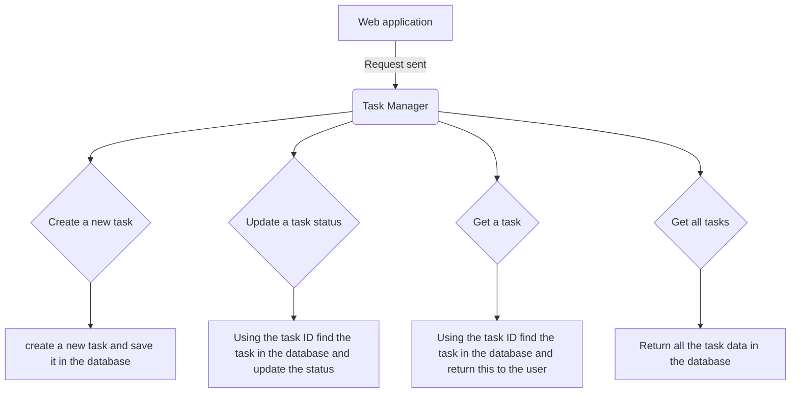

# Task Manager Application V1 

## Description:
A new task manager application is required to assist case workers in managing and tracking their tasks. 
The service creates a database in which to save required data, allowing case workers to retrieve and update task data. 

## Flowchart 

## Project structure: 

## Task Manager Application 
This starts the application and creates the required task manager database.

## Create Task Controller
This class handles the call for a new task to be created, returning a success message with the assigned ID for that task.

## Retrieve Task Controller
This class handles the call to retrieve the details of a particular task, using the ID of the task to search the database and return and data
found. 

## Task
POJO class for a task object. 

## Update status controller 
This class handles the call to update the status of a particular task using the ID to search the database and updating the task data. 

## Save Task
This class saves a new task in the database. 