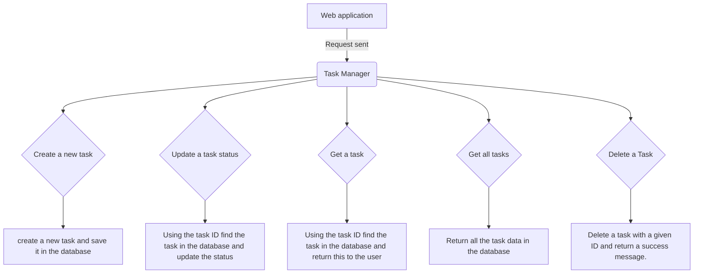

# Task Manager Application V1 

## Description:
A new task manager application is required to assist case workers in managing and tracking their tasks. 
The service creates a database in which to save required data, allowing case workers to retrieve and update task data. 

## Flowchart 


## Project structure: 

## Task Manager Application 
This starts the application and sets up the services.

## Create Task Orchestration
This class orchestrates the validation of the user input data, creating a task if this meets the validation requirements. 
This new task is then saved in the database and a success message is returned to the consumer. 

## Task Management System Controller
This class implements the Task Management system API and handles the mapping of the requests.  

## Rest Exception Handler
Handles the exceptions thrown by the service. 

## Update Status Orchestration
This class orchestrates the validation of user input and updating the status of a Task, returning a success message to the 
consumer or an error message if the task is not found. 

## Task Not Found Exception 
Custom exception for when a task is not found with a given ID. 

## Task Validation Error Exception
Custom exception for any validation errors found. 

## Status Validation 
Class to validate the user input status of a task. 

## Task Validation
Class to validate the user input data for the task, class utlises status validation class to validate status. 

## ID Validation 
Class to validate transaction ID and Task ID. 

## Validation Orchestration 
This class orchestrates the validation required for each type of request. 

## Update Status Validation
Class to validate the user input Id and status of a task, class utilises status validation class to validate status. 

## Task
POJO class for a task object. This pojo is annotated to be used as a schema to create the required database. 

## Create Task 
Creates a new task object, assigns an ID, and populates the task object with the 
validated user input data. 

## Get a task
Class to access the database using the supplied ID and return the task data.

## Retrieve Tasks
Class to retrieve all tasks in the database. 

## Save Task
This class saves a new task in the database. 

## Update status
Updates the status of the task using the ID. 

## Task Removal 
Class to delete a task from the database. 

## Date Checker 
Date Checker class which makes a call to Nager Date API to determine if a date is a uk bank holiday.
The date checker also checks if the date lands on a bank holiday. 

## Task repository
Interface repository which extends JPA repository to complete database requests. 

## Testing 
Testing contains unit testing, mocking out any dependant classes.
Integration testing has been set up using mock mvc to mock web requests 
to end points and check service functionality against expected output.

To run all tests:
```
mvn clean test
```

## Site Report 

Site report includes checkstyle and spotbugs analysis of the project. 
To generate the site report:
```
mvn compile site
```
These can then be viewed by going to the generated reports in:
target>site>project-reports.html